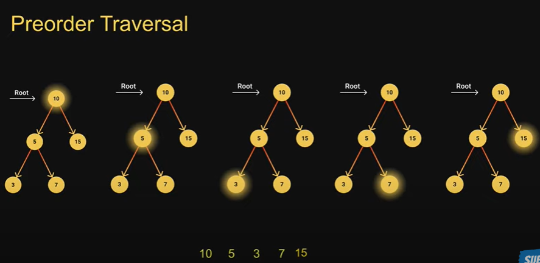
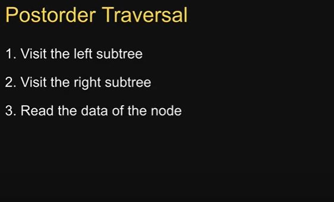
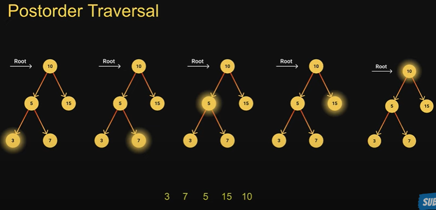
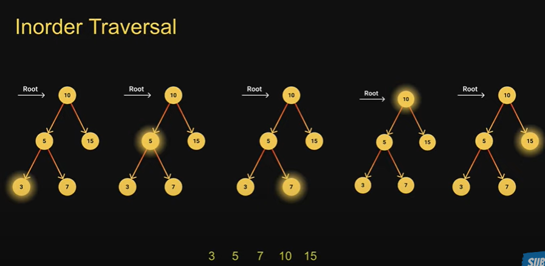

## Node Insertion

1- create a new node
2- senario one: the tree is empty, make this node the root of the tree
3- the trre is not empty:

## Tree Traversal
  ### Types:
  1- DFS
  
  2- BFS

## DFS

1- visit root node

2- visit all the nodes in the left subtree

3- visit all the node in the right subtree

## Preorder DFS Traversal
       1- start from the root node, read the node
      
       2- read the node f the left subtree
       
       3- read the data of the right subtree

  
  ## Postorder DFS Traversal:

## Inorderrder DFS Traversal:

